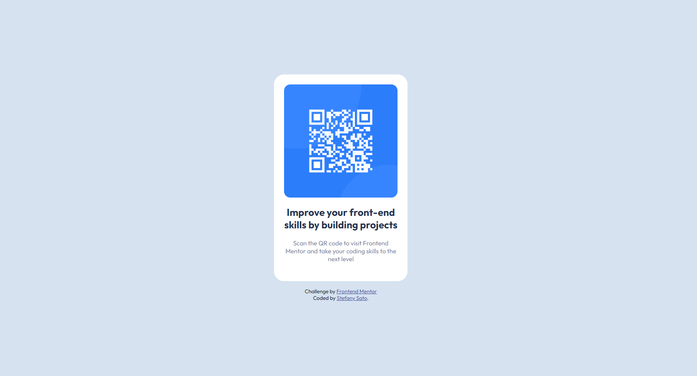

# Frontend Mentor - QR code component solution

This is a solution to the [QR code component challenge on Frontend Mentor](https://www.frontendmentor.io/challenges/qr-code-component-iux_sIO_H). Frontend Mentor challenges help you improve your coding skills by building realistic projects. 

### Screenshot

### Links

- Solution URL: [Solution - Frontend Mentor](https://www.frontendmentor.io/solutions/qr-code-component-xclxByzSMp)
- Live Site URL: [Live Site](https://stefanysato.github.io/qr-code-component/)

## Author

- Frontend Mentor - [@stefanysato](https://www.frontendmentor.io/profile/stefanysato)